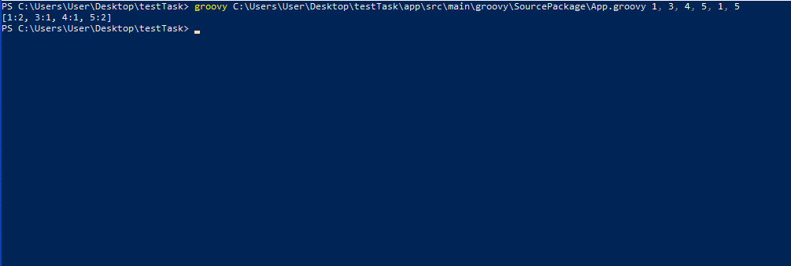
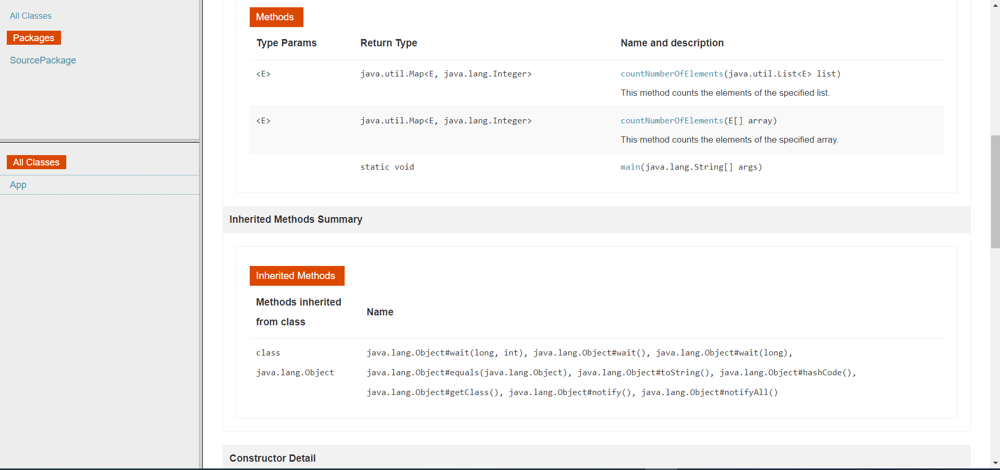

## Groovy app

This repository is the home of the Groovy app.
This app using two utility methods, which are taking
a list or array of elements,
calculate amount unique elements and return a Map,
where the key - is an element, the value - is its number.

#### Using app:

- You can download project from GitHub:
  
- use app in console: 
groovy [path/to/app.groovy] [array]
Array elements are separated by a space 
or separated by a comma and a space.  

Example of using app.

#### Groovydoc.

Path: "build/docs/groovydoc/SourcePackage/index.html"

